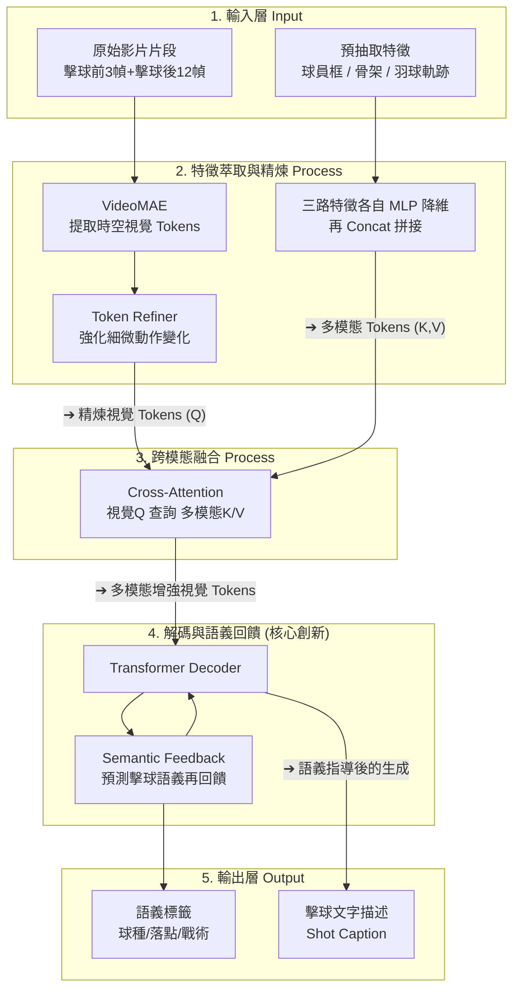

# Paper Analyzer — 學術論文深度解析

⚠️ **這是生產級指令。你的唯一任務：產出一篇讓讀者覺得"比我讀論文還清楚"的深度HTML長文。**

## 快速使用

```
/paper-analyzer https://arxiv.org/abs/2605.07363
/paper-analyzer /path/to/paper.pdf
/paper-analyzer  貼上文本
```

---

## 強制工作流（每一步必須執行，不可跳過）

### Round 1：獲取論文全文 ⛔

| 輸入 | 執行 |
|------|------|
| arxiv URL | **同時讀** arxiv.org/abs/（摘要）和 arxiv.org/html/（全文HTML） |
| PDF路徑 | 用PDF讀取工具讀全文。分多次直到全部獲取 |
| 文本 | 全部使用 |

**自檢**：有沒有完整內容？沒有 → 換方式繼續。

### Round 2：搜尋開原始碼 ⛔

1. 從論文中提取程式碼倉庫連結（通常在頁尾或 Introduction 末）
2. 沒有則用論文標題+作者名搜尋 GitHub
3. 克隆：`git clone --depth 1 <url> /tmp/paper_code`
4. 閱讀 README → 核心原始碼檔案 → 配置檔案

**根據程式碼狀態分支處理**：

| 狀態 | 處理 | 文章體現 |
|------|------|---------|
| ✅ 已釋出 | 讀核心檔案，找 ≥2 處論文方法↔原始碼對應 | 貼程式碼段（≤30行），標註 `檔案路徑:行號` |
| ⏳ 待發布 | 檢查 README/Release 標記 | 標註狀態+倉庫連結 |
| ❌ 無程式碼 | 搜尋替代實現/相關專案 | 註明"本文未提供公開程式碼" |

### Round 3：深度分析 ⛔ 內部完成，不展示過程

1. 核心創新：論文做了什麼別人沒做的？（1-3個，每個一句話提煉）
2. **方法流程拆解（畫圖前必做）**：先把整條 pipeline 整理成一張 Input→Process→Output 拆解表，**逐階段**記下四件事：
   - **輸入**：這一階段吃進什麼（原始資料 / 上一階段的產出）
   - **模組 / 操作**：用哪個具體模組或運算（寫出真名，如 VideoMAE、MMPose、Cross-Attention）
   - **產出**：這一階段吐出什麼
   - **該產出的作用**：這個產出接下來被誰用、用來做什麼、為什麼需要它
   ⚠️ **整理出這張表之後，才在 Round 5 據此畫 Mermaid 圖——不要邊想邊畫、不要隨便畫。**
3. 關鍵實驗：哪個結果最有說服力？為什麼？逐一弄懂作者每個關鍵數字（含消融）代表什麼。
4. 論文弱點：作者自述 + 你的判斷
5. 程式碼對應：每個 component 對應哪個檔案/函式
6. **來源核對（內部）**：每個重要主張/數字，記下它出自論文哪裡（章節 / Figure / Table）。無法在原文找到對應的，不要寫進文章。

### Round 4：詢問使用者 ⛔

必須問風格選擇，使用者未回則預設 academic。

### Round 5：寫作輸出HTML ⛔

按選定風格的要求寫，輸出完整HTML。模板見下文。

### Round 6：自我審查 ⛔

逐項檢查，不通過則修改直到通過。

---

## 三風格詳細要求

---

### storytelling（故事型）— 像一篇公眾號爆文

**硬標準**：
- 字數 ≥ 3000
- 段落 ≥ 15
- 引用論文原文 ≥ 3 處
- 生動類比/比喻 ≥ 2 個
- 結尾金句 1 句

**結構要求（按順序，缺一不可）**：

```
1. 鉤子開頭（2-3段）
   — 反常識問題 / 引人共鳴的場景 / 讓人"等等再說一遍？"的事實
   — 不要直接講技術。先讓讀者好奇。

2. "為什麼會這樣"（3-4段）
   — 解釋現有方法的邏輯和它的瓶頸
   — 用簡單例子說明
   — 讓讀者感到"確實需要一種新方法"

3. 核心洞察（1-2段）
   — 論文最關鍵的那一句話發現
   — 用一句話說清楚 + 一個類比強化

4. 方法詳解（5-8段，全文最重點）
   — 分步驟展開：怎麼做 → 為什麼這樣設計 → 和舊方法的關鍵區別
   — 每個步驟配一個類比
   — 引用論文原文（公式/演算法描述）≥ 3 處
   — 用對比表呈現新舊方法差異

5. 實驗效果（3-4段）
   — 最重要的實驗結果 + 資料解讀
   — 不只是報數字，要解釋"這意味著什麼"
   — 用表格呈現關鍵對比資料

6. 深層意義（2-3段）
   — 這個工作對行業意味著什麼
   — 不止一個角度：技術意義、產業意義、方法學意義

7. 侷限（1-2段）
   — 作者自述的侷限 + 你的判斷

8. 收束（1段）
   — 回到開頭的場景/問題，形成閉環
   — 讀者帶著"我懂了"的感覺離開

9. 金句
   — 一句話，讓人能記住並轉述
```

**寫法要求**：
- 多用"你"和讀者對話（"你有沒有想過""你猜怎麼著"）
- 段落短，一段不超過 4 句話
- 技術詞出現時要立刻給"人話解釋"
- 資料要翻譯成可感知的東西（"15 斤荔枝"而不只是"15 斤"）

---

### academic（學術型）— 先抓重點、再按需深入

⚠️ **核心原則：前置重點、精簡後段。讀者要的是「快速抓重點」，不是又長又慢的論文復刻。**
**別想太久、別灌字數；把最有用的放最前面，後段用「濃縮標題 → 細節」收斂。**

**硬標準**：
- 字數 ≥ 2000（夠清楚即可，不為湊字數注水）
- 論文公式引用 ≥ 2 處（僅關鍵公式，用 KaTeX 渲染；不重要的公式不必搬）
- 論文圖片/圖表引用 ≥ 2 處（標註 Figure number）
- 實驗資料表格 ≥ 1 張
- 程式碼段 ≥ 2 段（如有程式碼）
- 指出侷限 ≥ 2 處

**結構要求**（h2 順序固定，標題須包含括注的關鍵字）：

```
1. 論文元資訊
   標題 · 作者 · 連結 · 程式碼狀態
   （必須在最前面、在「快速抓重點」之前；後處理依賴它解析後設資料）

2. 快速抓重點（What / Why / How）  ← 全文最先、最重要，讀者先看這段就能抓到重點
   用 4 個 h3 子段，簡潔有力：
   ① 核心問題與價值（Gap）：研究想解決什麼？現有方法缺在哪？為何值得做？
   ② 方法流程（Input → Process → Output）：這是讀者最想看的一段，要做到位。
      依 Round 3 整理好的 I→P→O 拆解表，畫**一張分層流程圖**＋**配一段逐步文字說明**。

      ⚠️ **流程圖規格（務必照做，不要隨便畫一張潦草圖）**：
      - 用 `flowchart TB`，**每個階段一個 `subgraph`**：輸入層 → 特徵萃取/編碼 →
        融合/核心模組 → 解碼/預測 → 輸出層（依論文實際階段調整命名與數量）。
      - **每個節點寫出具體模組真名 ＋ 它的產出/作用**，不要只寫「編碼器」「模型」這種空泛詞。
        例：`VideoMAE 提取時空視覺 Tokens`、`Token Refiner 強化細微動作變化`。
      - **用邊標籤描述「流動的是什麼」**：如 `-->|Q（查詢）|`、`-->|top-8 heads|`、
        `-->|➔ 產出：精煉視覺 Tokens|`。讓讀者一眼看懂資料怎麼從輸入流到輸出。
      - 圖要涵蓋**整條實驗鏈路**：原始資料輸入 +（若有）預先抽取的外部特徵 → 模型各階段 → 最終輸出。
      - 節點 ID 用 ASCII；節點文本可中文，換行用 `<br/>`，避免中文標點和特殊字元。
      - 範例見下方「Mermaid 分層流程圖示例」。

      **圖後逐步文字說明（必寫）**：依輸入層→各處理層→輸出層的順序，**逐步**講清楚
      「每一步吃什麼、用什麼模組、吐出什麼、這個產出拿來幹嘛」。要像在跟人解說，
      讓讀者看完這段就懂整篇論文在做什麼（這段會被帶進 Notion，是最有價值的部分）。
   ③ 資料集製作方法與來源：資料怎麼來、怎麼標註/處理、規模與特性
   ④ 關鍵創新點（Novelty）：哪部分是新的 / 哪部分只是整合既有技術 /
      「如果移除創新點，論文還剩什麼價值？」

3. 對自身研究的幫助  ← 針對「我的研究脈絡」（reader 提示會注入）書寫
   用「<strong>濃縮標題：</strong>細節」的形式，1–3 條。
   範例語氣：「<strong>極佳的擊球類別擴充源（對自身研究的幫助）：</strong>
   該研究最核心的價值在於提供了 18 種極詳盡的羽球技術分類，是完美的動作擴充庫，
   能將您的評估方法直接套用至這 18 種揮拍場景……」
   若 reader 未提供研究脈絡，則退為「對相關研究方向的可遷移性」通用版，別硬掰。

4. 方法詳解（3–5 段，按需深入；不是越長越好）
   — 每個核心創新點講清：①問題 ②怎麼做（關鍵公式配 $$...$$）③為什麼有效 ④與已有方法差異
   — 引論文 Figure/Table 編號；有程式碼則穿插原始碼分析

5. 實驗分析（2–3 段，挑最有說服力的結果）
   — 實驗設定一句帶過；主要結果配表格。
   ⚠️ **重點是「解讀作者的實驗資料」，不是抄數字**：
     · 主結果表：每個關鍵數字代表什麼？贏 baseline 多少、這個差距在實務上意味著什麼？
     · 消融實驗：拿掉/加上哪個模組或模態，分數怎麼變？**哪個貢獻最大、為什麼**（結合該領域常識解釋）？
     · 用「這個數字說明了……」的句式，把資料翻譯成讀者能懂的結論。

—— 以下後段一律「濃縮標題 → 細節」：每個 h2 第一句用 <strong> 粗體一句話講完主旨，再展開 ——

6. 討論（先濃縮標題，再 2 段內細節）
   — 方法適用邊界 / 未解決的問題 / 對未來工作的啟示

7. 侷限分析（先濃縮標題，再細節）
   — 作者自述 ≥ 1 處 + 你的獨立判斷 ≥ 1 處

8. 研究脈絡與前置工作（先濃縮標題，再精簡細節）
   — 重點是幫我補充「該領域其他研究的最新進度 / 同期工作」，讓我追上 related work
   — 精簡幾句帶到關鍵前置工作與本文的相對定位即可，不要長篇

9. 產品落地分析（先濃縮標題，再細節）
   — 真實落地還需哪些工程、主要瓶頸、適用規模

10. 結論（1 段）
   — 凝練貢獻 + 展望
```

**寫法要求**：
- 前置重點、後段收斂；該精簡的別注水，該深入的（方法/創新）講透
- 後段（討論/侷限/研究脈絡/產品落地）每個 h2 第一句用 `<strong>` 粗體濃縮標題，再接細節
- 每個關鍵公式後跟一句"人話"解釋：這個公式在說什麼
- 引用論文的 Fig/Table/Section 編號；表格資料要有解讀，不只貼資料
- 數學符號首次出現要解釋含義

**Mermaid 分層流程圖示例**（方法流程子段必備的那張圖——分層 subgraph、節點標產出、邊標流動）：

（節點 ID 用 ASCII；節點文本中文用 `<br/>` 換行；邊標籤用 `➔ 產出：…` 說明流動的是什麼。實際圖請依論文真實模組與階段調整，別照抄此例。）

---

### concise（精煉型）— 最快掌握核心

⚠️ **精煉 ≠ 敷衍。精煉是資訊密度極高、但該有的全有。**

**硬標準**：
- 字數 ≥ 1200（不能低於這個數）
- 必須有：核心摘要盒 + 表格 + 視覺化圖表 + 金句
- ⚠️ **必須包含至少 1 個 Mermaid 圖表**（架構圖或對比圖）

**結構要求**：

```
1. 頭圖（Mermaid圖表）—— 全文最核心架構/對比的一張圖
   型別可以是：flowchart（流程圖）、graph（對比圖）、或 timeline

2. 核心摘要盒
   — 5 行以內
   — 覆蓋：做什麼 / 怎麼做 / 效果 / 適用場景

3. 關鍵創新（3-5 個，編號列出）
   — 每個 2-4 句
   — 一句話說創新點 → 一句話說怎麼做的 → 一句話說為什麼重要

4. 核心資料表
   — 最多 5 行資料
   — 突出和 baseline 的對比

5. 金句收尾
```

**Mermaid 圖表示例**（⚠️ 節點文本避免中文特殊字元，用英文或簡單ASCII。用 `<br/>` 換行）：
```mermaid
flowchart TB
    subgraph DSA["DSA: 64 heads scan all L tokens"]
        Q1[Query] --> H1[Head 1..64]
        H1 --> TK1[Score: O(64L)]
    end
    subgraph MISA["MISA: route to h=8 heads"]
        Q2[Query] --> RTR[Router: O(64M)]
        RTR -->|top-8| H2[8 active heads]
        H2 --> TK2[Score: O(8L)]
    end
    DSA -->|8x fewer heads| MISA
```

---

## HTML 輸出模板

生成HTML時使用此模板，確保含 KaTeX 公式渲染 + Mermaid 圖表支援：

```html
<!DOCTYPE html>
<html lang="zh-CN">
<head>
<meta charset="UTF-8">
<meta name="viewport" content="width=device-width, initial-scale=1.0">
<title>論文標題 — 深度解讀</title>
<style>
:root{--text:#1a1a1a;--bg:#fafaf8;--accent:#2563eb;--muted:#6b7280;--border:#e5e7eb;--code-bg:#f3f4f6}
*{margin:0;padding:0;box-sizing:border-box}
body{font-family:-apple-system,"PingFang SC","Noto Serif SC",serif;color:var(--text);background:var(--bg);line-height:1.85;padding:2.5rem 1.5rem;max-width:720px;margin:0 auto;font-size:17px}
h1{font-size:2rem;margin:0 0 .3rem;line-height:1.3}
h2{font-size:1.35rem;margin:2.8rem 0 .8rem;color:var(--accent);padding-bottom:.4rem;border-bottom:1px solid var(--border)}
h3{font-size:1.1rem;margin:1.5rem 0 .5rem;color:#333}
.meta{color:var(--muted);font-size:.9rem;margin-bottom:2.5rem;line-height:1.8}
.meta a{color:var(--accent);text-decoration:none}
blockquote{border-left:3px solid var(--accent);padding:.6rem 1.2rem;margin:1.5rem 0;background:#f0f4ff;border-radius:0 8px 8px 0}
pre{background:var(--code-bg);padding:1rem 1.2rem;border-radius:8px;overflow-x:auto;font-size:.85rem;line-height:1.5;margin:1.5rem 0;border:1px solid var(--border)}
code{font-family:"SF Mono","Fira Code",monospace;font-size:.9em}
p{margin:1rem 0}
strong{color:#111}
table{width:100%;border-collapse:collapse;margin:1.5rem 0;font-size:.93rem}
td,th{border:1px solid var(--border);padding:.6rem .9rem;text-align:left}
th{background:#f9fafb;font-weight:600}
.summary-box{background:linear-gradient(135deg,#f0f4ff,#faf5ff);padding:1.5rem;border-radius:12px;margin:1.5rem 0}
.summary-box h3{margin:0 0 .5rem;color:var(--accent)}
.golden{font-size:1.25rem;font-weight:600;color:var(--accent);text-align:center;padding:2rem 1rem;border-top:2px solid var(--accent);border-bottom:2px solid var(--accent);margin:2.5rem 0;line-height:1.5}
@media(max-width:600px){body{font-size:16px;padding:1.2rem 1rem}h1{font-size:1.5rem}}
</style>
<!-- KaTeX -->
<link rel="stylesheet" href="https://cdn.jsdelivr.net/npm/katex@0.16.9/dist/katex.min.css">
<script defer src="https://cdn.jsdelivr.net/npm/katex@0.16.9/dist/katex.min.js"></script>
<script defer src="https://cdn.jsdelivr.net/npm/katex@0.16.9/dist/contrib/auto-render.min.js"
  onload="renderMathInElement(document.body,{delimiters:[{left:'$$',right:'$$',display:true},{left:'$',right:'$',display:false}]})"></script>
<!-- Mermaid -->
<script src="https://cdn.jsdelivr.net/npm/mermaid@10/dist/mermaid.min.js"></script>
<script>mermaid.initialize({startOnLoad:true,theme:'default',securityLevel:'loose'});</script>
</head>
<body>
<!-- 內容 -->
</body>
</html>
```

**公式用 `$$...$$` 或 `$...$`，KaTeX 自動渲染。**
- ✅ 正確：`$H^I$`、`$H^{I}$`、`$\mathbf{q}_{t,j}^I$`
- ❌ 錯誤：`$H^\I$`（`\I` 未定義）、`$H^I$` 寫在 `<pre>` 標籤內

**Mermaid 圖用 `<pre class="mermaid">...</pre>` 包裹。節點文本避免中文標點和特殊字元。**

---

## 自我審查清單（Round 6）

生成後逐條檢查，不通過則修改：

### 通用
- [ ] 字數達標？（story≥3000 / academic≥4000 / concise≥1200）
- [ ] 引用論文原文 ≥ 3 處？
- [ ] 每個核心創新獨立深度展開？
- [ ] 至少 1 個實驗結果做深入解讀？
- [ ] 程式碼狀態已提及？
- [ ] 有程式碼則原始碼 ≥ 2 段 + 檔案路徑？
- [ ] 指出侷限 ≥ 2 處（至少 1 處是作者自述的）？
- [ ] **關鍵主張/數字都能在原文（章節 / Figure / Table）找到對應、無捏造？無法核實的已改寫或刪除？**
- [ ] HTML 格式完整，可在瀏覽器開啟？
- [ ] 無 AI 套話（"深入探討""至關重要""值得注意的是"）？

### storytelling 專屬
- [ ] 有鉤子開頭？
- [ ] 有 ≥ 2 個類比/比喻？
- [ ] 用"你"和讀者對話？
- [ ] 有收束段落形成閉環？
- [ ] 有金句？

### academic 專屬
- [ ] 「快速抓重點」放在最前面（元資訊之後）、含 4 個 h3 子段 + 一張 Mermaid 流程圖？
- [ ] **方法流程圖是分層 subgraph 的 Input→Process→Output？覆蓋資料輸入→模型各階段→輸出？**
- [ ] **圖中每個節點都寫出具體模組真名＋它的產出/作用（不是「編碼器」「模型」這種空泛詞）？**
- [ ] **流程圖和 Round 3 整理的 I→P→O 拆解表一致？圖後有逐步文字說明（每步吃什麼/用什麼/吐什麼/作用）？**
- [ ] 有「對自身研究的幫助」段（依注入的研究脈絡，濃縮標題+細節）？
- [ ] 後段（討論/侷限/研究脈絡/產品落地）每段都以 `<strong>` 濃縮標題開頭？
- [ ] 字數 ≥ 2000（精簡而不注水）？
- [ ] 關鍵公式 ≥ 2 處（KaTeX 渲染）？
- [ ] 論文圖/表引用 ≥ 2 處（Fig/Table 編號）？
- [ ] **實驗分析有解讀作者關鍵數字（含消融哪個貢獻最大），不只貼資料？實驗資料表 ≥ 1 張？**

### concise 專屬
- [ ] 有 Mermaid 圖表？
- [ ] 有核心摘要盒？
- [ ] 有對比資料表？
- [ ] 有金句？
- [ ] 字數 ≥ 1200？

---

## 參考檔案

- `styles/storytelling.md` — 故事型補充規範
- `styles/academic.md` — 學術型補充規範
- `styles/concise.md` — 精煉型補充規範
- `styles/with-formulas.md` — 公式詳解
- `styles/with-code.md` — 程式碼分析規範
- `scripts/generate_html.py` — HTML生成輔助指令碼
